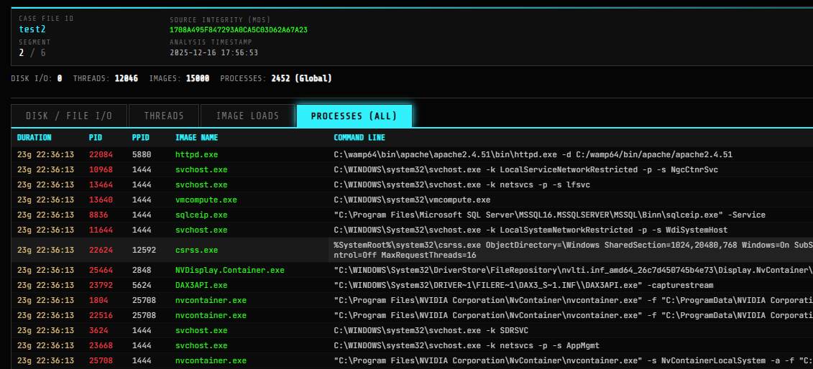
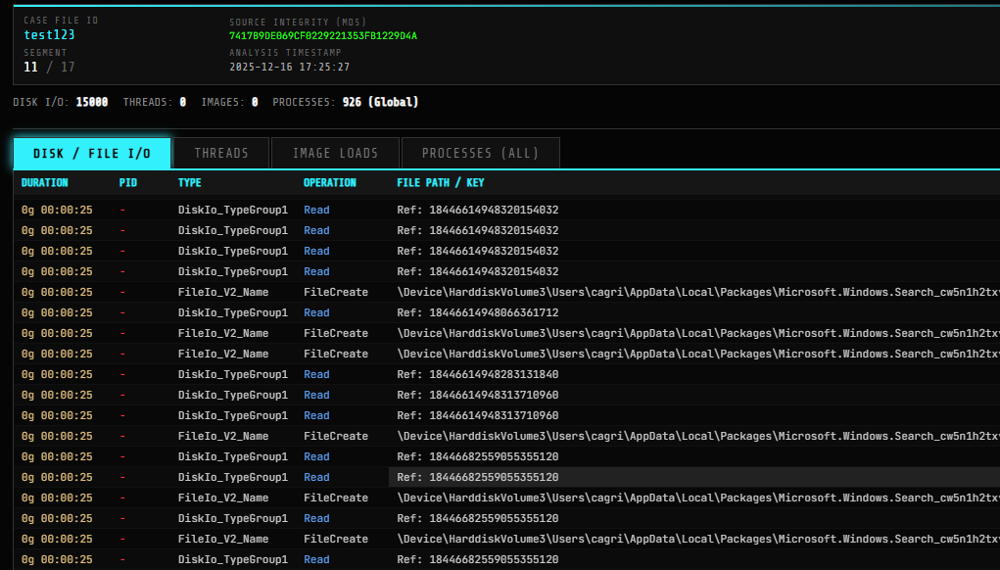

# WDIAnalysis.py
WDIAnalysis.py – Windows Diagnostic Infrastructure (WDI)  Analysis Tool

WDIAnalysis.py is a forensic and performance analysis tool designed to analyze Windows Diagnostic Infrastructure (WDI) logs.
The application focuses on boot and shutdown performance, disk/file I/O activity, thread behavior, image loads, and process execution, providing deep visibility into system-level events.
The tool converts ETL (Event Trace Log) files into XML format and performs structured, categorized analysis through a clean and user-friendly interface.

Key Features

🔍 XML-First Analysis Workflow

Parses converted ETL → XML files for structured and readable analysis.
Ensures accurate event correlation and timeline reconstruction.

📂 Disk / File / I/O Analysis

Detects intensive disk operations during boot and shutdown.
Identifies file access patterns and I/O bottlenecks.

🧵 Thread & Process Analysis

Enumerates threads and process execution sequences.
Highlights abnormal thread creation or execution delays.

🧩 Image Load Inspection

Analyzes DLL and executable image load events.
Identifies unsigned or suspicious binaries.

📊 Categorization & Timeline Reconstruction

Events are grouped by category:
Disk
File I/O
Threads
Image Loads
Processes

Provides chronological insights into system behavior.

🖥️ Graphical User Interface

Clean and readable UI for advanced forensic review.
Suitable for DFIR, malware analysis, and performance diagnostics.


## BootPerfDiagLogger.etl
BootPerfDiagLogger.etl captures detailed system activity during the Windows boot sequence. It records driver and service initialization events, disk and file access operations that occur during startup, process and thread creation activity, image load events for executables and DLLs, and overall boot performance metrics. This log file is commonly used for investigating slow boot times, analyzing startup malware persistence techniques, and troubleshooting problematic drivers or services that load early in the system lifecycle.

## ShutdownPerfDiagLogger.etl
ShutdownPerfDiagLogger.etl records system behavior during the Windows shutdown process. It contains information about process termination order, file and disk I/O activity occurring before shutdown, service stop delays, and thread cleanup operations. This log is particularly useful for analyzing shutdown delays, detecting hung or unresponsive processes, and performing forensic reconstruction of the system’s last activities before shutdown.

## Usage 

1) Install ETL parser (external reference):
```
git clone https://github.com/airbus-cert/etl-parser.git
cd etl-parser
pip install -e .
```
2) Go to WDI log directory:
```
C:\WINDOWS\System32\WDI\LogFiles
```
3) Convert ETL to XML:
```
etl2xml -i ShutdownPerfDiagLogger.etl -o ShutdownPerfDiagLogger.xml
etl2xml -i BootPerfDiagLogger.etl -o BootPerfDiagLogger.xml
```

4) Run WDIAnalysis:
```
WDIAnalysis.py --file BootPerfDiagLogger.xml
WDIAnalysis.py --file ShutdownPerfDiagLogger.xml
```
## Screenshots


